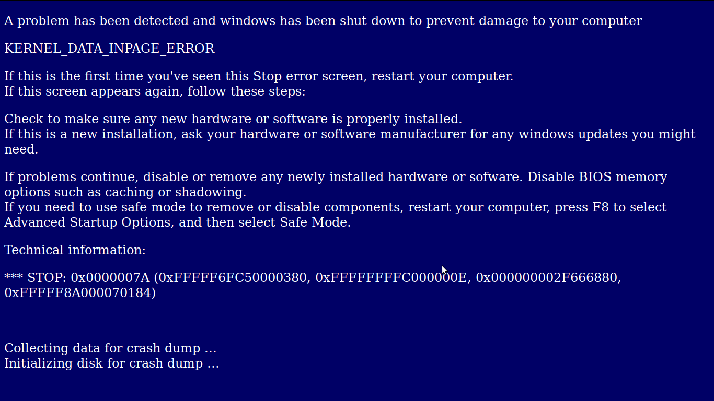

# Ödev
* Bir adet index.html adında bir dosya oluşturun.
* HTML iskelet yapısını yazın, ! ile hazır yapı kullanmayın.
* Sayfanın başlığı "Blue Screen of Death" olsun.
* icerik.txt dosyasının içerisindeki yazıyı görüntüdeki gibi sayfaya işleyin.
* Görüntüdeki sayfa şu özellikleri taşımaktadır:
    * arka plan rengi "#000066",
    * font rengi "white",
    * font büyüklüğü "5px",
    * font ailesi "Courier"

# Görüntü

## Efe Furkan KARAKAYA
